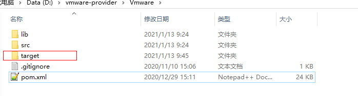
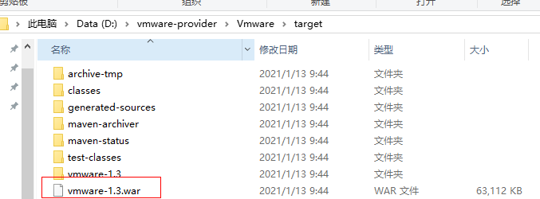
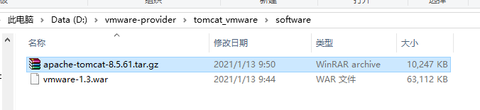

# VMware-provider

**README**

[Chinese](README_ZH.md) | [English](README.md)

# Contents
- [Abstract](#Abstract)
- [Supported vCenter Versions](#Supported vCenter Versions)
  - [Quick Start Guide](#Quick Start Guide)
  - [Preparations](#Preparations)
  - [Compilation and Packaging](#Compilation and Packaging)

# Abstract

**VMware-provider** is a Java Tomcat project. It provides vSphere Web Service APIs and vSphere Automation Java SDK for accessing VMware vCenter and performing operations on VMware vCenter resources.

# Supported vCenter Versions

| vSphere Web Service APIs                       | vSphere Automation Java SDK                            |
| ---------------------------------------------- | ------------------------------------------------------ |
| vCenter 5.5 , 6.0, 6.5, 6.7, 6.7U3, 7.0, 7.0U1 | vCenter 6.0, 6.5, 6.7, 6.7U1, 6.7U2, 6.7U3, 7.0, 7.0U1 |

# Quick Start Guide

This document provides guidance for you to get started with the VMware-provider. Before using the VMware-provider, you need to set up the vCenter test environment and install Maven. The following steps will guide you through this process.

## Preparations

### Installing JDK

**Step 1** Download the JDK installation package of version `1.8` at  [https://www.oracle.com/java/technologies/javase/javase-jdk8-downloads.html](https://www.oracle.com/java/technologies/javase/javase-jdk8-downloads.html).

**Step 2** Install the JDK.

**Step 3** Create and set the **JAVA_HOME** environment variable to point to the JDK installation path.

```
JAVA_HOME=<jdk-install-dir>
```

**Step 4** Set the PATH environment variable to point to the **bin** directory in the JDK installation directory.

```
PATH=<jdk-bin-dir>
```

### Installing Maven

**Step 1** Download the Maven installation package of version `3.0` or later at [https://maven.apache.org/download.cgi](https://maven.apache.org/download.cgi).

**Step 2** Install Maven.

**Step 3** Create and set the **MAVEN_HOME** environment variable to point to the Maven installation path.

```shell
MAVEN_HOME=<maven-install-dir>
```

**Step 4** Set the PATH environment variable to point to the **bin** directory in the Maven installation directory.

```shell
PATH=<maven-bin-dir>
```

### Downloading Tomcat

Download the Tomcat installation package of a version later than `8.0` at [http://tomcat.apache.org/](http://tomcat.apache.org/).

### <span id ="jar">Obtaining JAR Files</span>

**Step 1** Download the vsphere-automation-sdk-java `v7.0.0.1` software package at [https://github.com/vmware/vsphere-automation-sdk-java/tree/v7.0.0.1](https://github.com/vmware/vsphere-automation-sdk-java/tree/v7.0.0.1).

**Step 2** Decompress the software package to obtain the following JAR files in the **lib** directory:

- nsx-java-sdk-2.5.1.0.1.15419398.jar
- nsx-policy-java-sdk-2.5.1.0.1.15419398.jar
- nsx-vmc-aws-integration-java-sdk-2.5.1.0.1.15419398.jar
- nsx-vmc-policy-java-sdk-2.5.1.0.1.15419398.jar 
- nsx-vmc-sdk-common-2.5.1.0.1.15419398.jar 
- oidc-oauth2-sdk-0.0.1.jar
- ssoclient.jar 
- vapi-authentication-2.15.0.jar  
- vapi-runtime-2.15.0.jar  
- vapi-samltoken-2.15.0.jar 
- vapi-vmc-sdk-2.15.0.jar  
- vim25.jar 
- vmc-bindings-1.24.0.jar  
- vmc-draas-bindings-1.9.0.jar
- vsphereautomation-client-sdk-3.3.0.jar
- vsphereautomation-lookupservice-1.0.0.jar

## Compilation and Packaging

**Step 1** Decompress the VMware-provider software package.


**Step 2** Go to the **Vmware** directory and create the **lib** directory.


**Step 3** Copy the obtained jar files to the **lib** directory.

**Step 4** Go to the **Vmware** directory and run the Maven command to compile and package the code. The commands are as follows:

```shell
mvn initialize
```


```shell
mvn clean install
```


**Step 5** Wait until the packaging is successful.



**Step 6** Check whether the **vmware-x.x.war** package is generated in the **target** directory in the software package directory.



**Step 7** Copy **vmware-x.x.war** to **\tomcat_vmware\software**.


**Step 8** Copy the Tomcat installation package to **\tomcat_vmware\software**.



**Step 9** Compress the **tomcat_vmware** directory to obtain the tomcat_vmware.tar.gz file.


