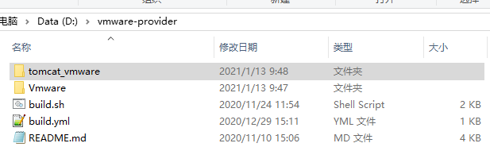
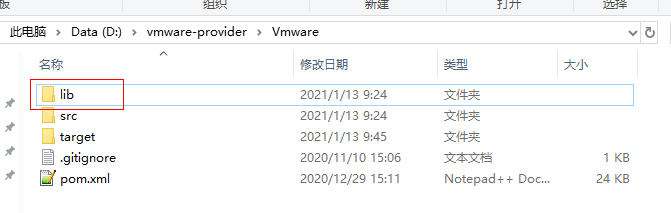
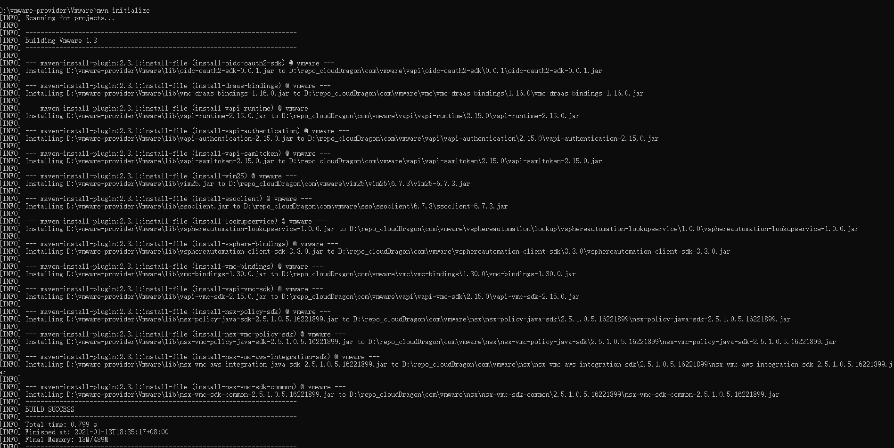
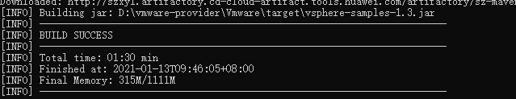
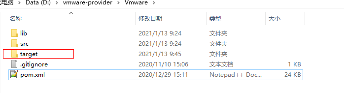
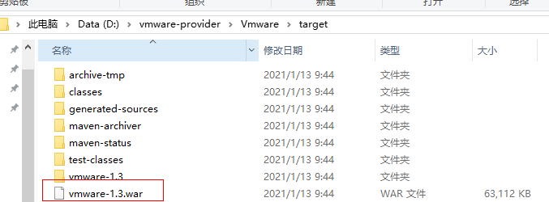
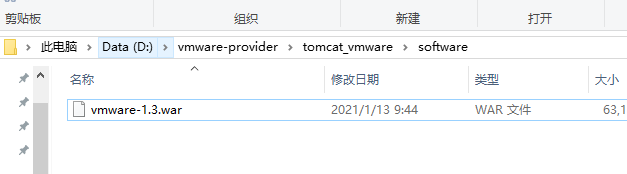
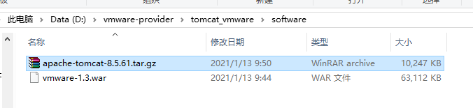
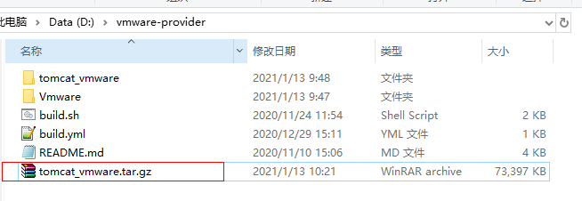

# Vmware-provider

**说明**

[中文](README_ZH.md) | [英文](README.md)

# 目录
- [摘要](#摘要)
- [支持的vcenter版本](#支持的vcenter版本)
- [快速入门指南](#快速入门指南)
  - [准备工作](#准备工作)
  - [编译并打包](#编译并打包)

# 摘要

Vmware-provider是一个Java tomcat项目，提供了vSphere Web Service APIs和vSphere Automation Java SDK两种方式用于访问VMware vCenter，并对VMware vCenter的资源进行操作。

# 支持的vcenter版本

| vSphere Web Service APIs                       | vSphere Automation Java SDK                            |
| ---------------------------------------------- | ------------------------------------------------------ |
| vCenter 5.5 , 6.0, 6.5, 6.7, 6.7U3, 7.0, 7.0U1 | vCenter 6.0, 6.5, 6.7, 6.7U1, 6.7U2, 6.7U3, 7.0, 7.0U1 |

# 快速入门指南

本文档将引导您逐步入门并使用Vmware-provider。在使用之前，您将需要设置vCenter测试环境并安装maven，以下步骤将带您完成此过程。

## 准备工作

### 安装JDK

**步骤1** 下载安装包，JDK版本为 `1.8`。下载地址为 [https://www.oracle.com/java/technologies/javase/javase-jdk8-downloads.html](https://www.oracle.com/java/technologies/javase/javase-jdk8-downloads.html) 。

**步骤2**  安装JDK。

**步骤3** 新建**JAVA_HOME**环境变量为JDK的安装路径。

```
JAVA_HOME=<jdk-install-dir>
```

**步骤4**  配置PATH环境变量为JDK安装目录下的https://github.com/vmware/vsphere-automation-sdk-java/tree/v7.0.0.1目录。

```
PATH=<jdk-bin-dir>
```

### 安装Maven

**步骤1**  下载安装包，maven的版本为 `3.0`以上，下载地址为 [https://maven.apache.org/download.cgi](https://maven.apache.org/download.cgi)。

**步骤2** 安装Maven。

**步骤3** 新建环境变量**MAVEN_HOME**为Maven的安装路径。

```shell
MAVEN_HOME=<maven-install-dir>
```

**步骤4**  配置PATH环境变量为maven安装目录下的**bin**目录。

```shell
PATH=<maven-bin-dir>
```

### 下载tomcat

下载tomcat安装包，tomcat版本为 `8.0`以上，下载路径为 [http://tomcat.apache.org/](http://tomcat.apache.org/) 。

### <span id ="jar">获取jar文件</span>

**步骤1** 下载vsphere-automation-sdk-java  `v7.0.0.1`软件包。下载地址为https://github.com/vmware/vsphere-automation-sdk-java/tree/v7.0.0.1。

**步骤2** 解压软件包，获取**lib**下jar文件。获取的jar文件如下：

- nsx-java-sdk-2.5.1.0.5.16221899.jar
- nsx-policy-java-sdk-2.5.1.0.1.15419398.jar
- nsx-vmc-aws-integration-java-sdk-2.5.1.0.1.15419398.jar
- nsx-vmc-policy-java-sdk-2.5.1.0.1.15419398.jar
- nsx-vmc-sdk-common-2.5.1.0.1.15419398.jar
- oidc-oauth2-sdk-0.0.1.jar
- ssoclient.jar
- vapi-authentication-2.15.0.jar
- vapi-runtime-2.15.0.jar
- vapi-samltoken-2.15.0.jar
- vapi-vmc-sdk-2.15.0.jar
- vim25.jar
- vmc-bindings-1.24.0.jar
- vmc-draas-bindings-1.9.0.jar
- vsphereautomation-client-sdk-3.3.0.jar
- vsphereautomation-lookupservice-1.0.0.jar

**步骤3** 下载KMC
然后到FCV pro环境将任何一个tomcat目录下的服务的lib目录下的KMC包也下载到lib目录中

/ROBO安装目录/tomcat_1/webapps/dfxmgt/WEB-INF/lib/com.huawei.kmc-jni-java-3.0.0.SPC005.B002-RELEASE.jar

## 编译并打包

**步骤1** 解压Vmware-provider软件包。



**步骤2** 进入**Vmware**目录下，新建**lib**目录。



**步骤3** 将获取的[jar文件](#jar) 复制到**lib**目录下。

**步骤4** 进入**Vmware**目录下，执行maven命令,编译并打包。命令如下：

```shell
mvn initialize
```



```shell
mvn clean install
```



**步骤5** 打包成功。



**步骤6** **vmware-x.x.war**包的生成路径为软件包文件夹下的**target**文件夹。



**步骤7** 拷贝**vmware-x.x.war**到**\tomcat_vmware\software**。



**步骤8** 将tomcat的安装包拷贝到**\tomcat_vmware\software**。



**步骤9** 压缩**tomcat_vmware**文件夹，得到tomcat_vmware.tar.gz文件。


